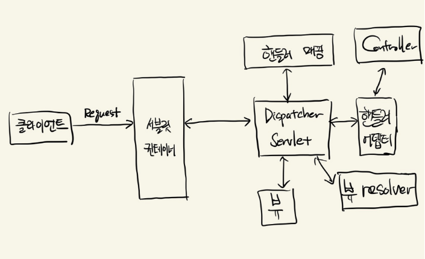
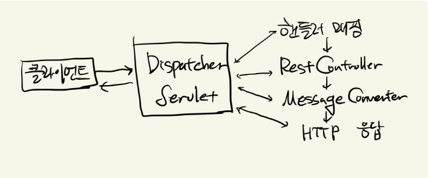

### **스프링 프레임워크**

스프링 프레임워크는 Java 기반의 애플리케이션 프레임워크로 다양한 기능을 제공한다. Java로 백엔드 개발을 할 때, 만약 객체 지향 방법인 SOLID를 다 지켜서 효율적인 코드를 짜려고 하면 결국은 스프링과 비슷하게 코딩한다고 한다. 스프링은 도구일 뿐이다.

**스프링의 핵심 가치는 애플리케이션 개발에 필요한 기반을 제공해서 개발자가 비즈니스 로직 구현에만 집중할 수 있게끔 하는 것이다.**

### **스프링 프레임워크 vs 스프링 부트**

스프링 프레임워크는 위에서 언급한 것처럼 다양한 기능을 제공한다. 그렇지만 기능을 사용하려면 제일 괴롭히는 건, 설정이다. 스프링에서 어떤 기능을 사용하려면 엄청난.. 설정 파일이 따라오게 된다.

스프링 프레임워크에서 필요한 모듈을 사용하기 위한 설정들을 쉽게 하기 위해서 스프링 부트를 사용한다. 스프링부트 공식 사이트에는 다음과 같은 내용이 있다.


(**"우리는 Spring 프레임워크와 함께 제공되는 많은 툴을 사용하고 즉시 사용할 수 있는 솔루션을 많이 보유하고 많은 양의 추가 코드를 작성할 필요가 없으므로 시간과 에너지를 절약할 수 있습니다.")**

#### **스프링 부트의 장점**

1.  의존성 관리 : 스프링 프레임워크에서는 개발에 필요한 각 모듈의 의존성을 직접 설정하고 호환되는 버전을 명시해야 한다. 하지만 스프링 부트에서는 이 같은 불편함을 ‘spring-boot-starter’라는 의존성을 제공하여 해결할 수 있다. (spring-boot-start 라이브러리 아래에 spring-boot-starter-web, spring-boot-starter-test 등등이 있다.)
2.  자동 설정 : 애플리케이션에 추가된 라이브러리를 실행하는 데 필요한 환경 설정을 알아서 찾아준다. 즉, 필요한 의존성을 추가하면 프레임워크가 이를 자동으로 관리해준다.  
      
    
3.  내장 WAS : 스프링 부트의 각 웹 애플리케이션에는 내장 WAS가 존재한다. spring-boot-starter-web의 경우 tomcat을 내장한다.

아래 예시는 메인 애플리케이션 코드이다.

```
@SpringBootApplication
public class UnifestaApplication {
    public static void main(String[] args) {
        SpringApplication.run(UnifestaApplication.class, args);
    }
}
```

여기서 @SpringBootApplication을 뜯어보면 다음 세 개의 어노테이션을 합쳐놓은 구성이다.

```
@SpringBootConfiguration
@EnableAutoConfiguration
@ComponentScan
```

스프링 부트 애플리케이션이 실행되면 @ComponentScan을 통해서 @Component가 붙은 클래스를 발견해서 빈으로 등록하고, @EnableAutoConfiguration 어노테이션을 통해서 설정들을 적용하고, @Conditional의 조건을 충족할 경우 빈에 등록되고, 애플리케이션에 자동으로 반영된다.

### **스프링 부트의 동작 방식**

스프링 부트에서 spring-boot-starter-web 모듈을 사용한다면 기본적으로 톰캣을 사용하고, MVC구조를 기반으로 동작한다.

만약에 서버에 요청이 들어오면 스프링 부트는 어떤 식으로 동작을 하게 될까?



서블릿(servlet)이라는 것은 클라이언트의 요청을 처리하고 결과를 반환하는 java 웹 프로그래밍 기술이다. 그럼 요청을 어떻게 처리하고 어떤 응답을 줄 지 결정해야 한다. 서블릿의 관리는 서블릿 컨테이너에서 관리한다. (컨테이너는 객체의 생성, 관리, 삭제까지 다 해주는 것 의미!! 도커에서 배움!)

즉, 서블릿 컨테이너는 서블릿 객체를 생성하고 관리하는 주체이다. 서블릿 컨테이너로 제일 많이 사용되는 것이 바로 톰캣이다.

서블릿은 기술이다. 여기서 서블릿의 역할을 하는 것은 스프링에서는 Dispatcher 서블릿이다.

일반적으로 스프링은 톰캣을 임베드해서 사용한다. 그렇기 때문에 서블릿 컨테이너와 Dispatcher Servlet은 설정값을 공유하게 된다.

그럼 Dispatcher Servlet의 역할을 뜯어보자. Dispatcher Servlet은 스프링에서 서블릿의 역할을 수행한다고 하였으니, 클라이언트의 요청을 처리하고 응답해주어야 한다.

만약에 요청이 들어오면 DispatcherServlet은 핸들러 매핑을 통해 요청 URI에 매핑된 컨트롤러를 탐색한다. 컨트롤러를 호출하는 것은 핸들러 어뎁터의 역할이다.

핸들러 어뎁터가 컨트롤러를 호출하면 return을 해줄 것이다. 해당 응답이 돌아오면 ModelAndView로 응답을 가공하여 반환한다.

만약 뷰 형식으로 리턴하는 컨트롤러라면 뷰 리졸버를 통해 뷰를 받아서 리턴하게 된다.

하지만, 대부분의 경험 상 프론트 개발자와 협업하기 때문에 JSON 형식으로 변환하여 응답하는 것을 원할 것이다. REST 형식의 @ResponseBody를 사용하면 JSON 형식으로 변환해서 응답할 수 있다.



### **REST**

Representational State Transfer의 약자로 시스템 아키텍쳐의 한 형식이다. 주고받는 자원에 이름을 규정하고 URI에 명시해 HTTP 메서드(GET, POST, PUT, DELETE)를 통해 해당 자원의 상태를 주고받는 것을 의미한다.

### **REST API**

API는 Application Programming Interface의 약자로 애플리케이션 인터페이스이다. 즉, REST API는 REST 아키텍처를 따르는 애플리케이션 인터페이스라고 생각할 수 있다.

REST 아키텍처를 구현하는 웹 서비스를 **RESTful 하다.** 라고 표현할 수 있다.