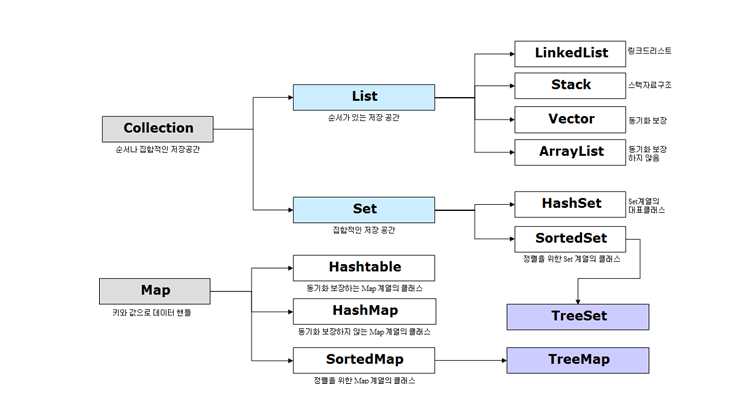

# Java 컬렉션 (Collection) 정리

Java Collection은 Java 언어에서 데이터를 저장, 처리, 관리하는 데 사용되는 API 모음이다.

특히나 자료구조에 대해서 이해한다면 쉽게 이해해서 사용할 수 있다.

객체들을 효율적으로 추가, 삭제, 검색할 수 있도록 java.util 페키지에 collection과 관련된 인터페이스와 클래스를 포함시켰기 때문에 사용할 수 있다.

(매번 찾아보는 것보다 한 번 정리해야겠다는 생각이 들어서 쓰게 되었다.)


데이터 구조엔 여러가지 종류들이 있다 : ArrayList, LinkedList, Hashtable, Tree ...

java가 제공하는 집합 인터페이스 : List, Set, Queue, Map 그리고 각각의 구현체들

***
***
## List
- 순서 있는 집합 → 어느 요소가 어디에 삽입되는지 제어가능!
- 중복된 요소들을 허용
- 어느 위치에 어떤 객체가 있는지를 신경씀

```java
List<String> words = List.of("Apple", "Bat", "Cat"); // of는 정적 메소드
words.size(); // 3
words.isEmpty(); // false
words.get(0); // Apple
words.contains("Dog"); // false
words.indexOf("Cat"); // 2
```

---

**of 메소드**
: Java 9부터 추가된 List 인터페이스의 메소드. 주어진 요소들을 포함하는 불변리스트를 생성함.
리스트 생성하고 초기화할 때 사용하면 좋다. 그리고 null 요소도 허용하지 않는다.
List.of로 만든 instance는 수정할 수 없다. (불변 리스트)

**immutable List**
불변 클래스란 무엇일까? -> String, BigDecimal, Wrapper 클래스는 불변이다. 
이 의미는 특정 클래스의 인스턴스를 만든 순간부터 이 값을 바꿀 수 없게 된다는 것이다.

가변 리스트를 만들고 싶으면 **ArrayList나 LinkedList, Vector**를 만들어야 한다.

```java
List<String> wordsArrayList = new ArrayList<String>(words);
List<String> wordsLinkedList = new LinkedList<String>(words);
List<String> wordsVector = new Vector<String>(words);
```
---
### ArrayList와 LinkedList의 차이

- ArrayList는 접근은 빠르지만 삽입 삭제가 느리다.  메모리가 연속적
- LinkedList는 접근은 느리지만 삽입 삭제가 빠르다.  메모리가 따로따로. 서로 연결되는 메모리 주소를 기억하고 있다.
- java에서의 LinkedList는 요소들이 양면으로 연결되어 있다. forward로 향하는 연결과 backward로 향하는 연결이 둘 다 존재한다. (doubly linked)
- **변경점이 적다면 ArrayList, 삽입과 제거가 빈번하다면 LinkedList를 사용하면 된다.**

Array : 배열은 모든 요소들을 순서대로 저장하고 언제나 요소 하나를 제거하면 그 요소를 제거한 후 그 다음 요소를 왼쪽으로 밀어야 한다. 하지만, 배열의 특정한 위치에 있는 요소를 갖고 오는 건 쉽다.

LinkedList : 각자 요소들은 다음 요소들과 연결되어 있다. 삽입과 삭제가 더 쉽다. 하지만 특정 위치에 있는 요소를 갖고 오거나 찾는 것은 연결점들을 다 건너 다니면 무엇이 있는지 찾아야 한다.


---
### Vector랑 ArrayList는 언제 구분해서 써야할까?

Vecotr 클래스는 자바1때부터 있었다. ArrayList는 자바1.2부터.(오래 전부터 있었다는 뜻)

그럼 Vector의 문제가 무엇이여서 ArrayList가 나타난 것일까?

- vector는 모든 메서드들이 synchronize가 되어있는데, ArrayList는 Synchronize되어 있지 않다.
- vector는 내부의 'add', 'remove', 'set'과 같은 변경 작업을 할 때 내부적으로 synchronized를 사용한다.
- **Synchronize 키워드**는 어떤 차이를 만들까?
  - 예를 들어서 한 클래스 안에 25개의 동기화된 메소드들이 있다고 하자.
  - 만약 이 Vector 클래스의 인스턴스가 여러 스레드 사이에 공유된다면, 스레드 중 단 하나만이 이 25개의 메소드들을 실행할 수 있다.
  - 즉, 이 동기화된 메소드들 안에서는 한순간에 오직 하나의 스레드만 코드를 실행시킬 수 있다.
  - 이렇게 하는 이유는 프로그램이 안전하길 바라기 때문이다.
  - 우리의 프로그램은 쓰레드 하나가 사용하든 15개의 쓰레드가 사용하든 행동방식이 바뀌면 안되고, Synchronized가 그 역할을 하려 하는 것이다.
  - Vector는 Thread-safe하다. 여러 쓰레드들 사이에서 데이터를 공유하는 상황에서 Vector를 사용할 수 있다.
  - 그러나 ArrayList는 안전하지 않다. 그치만, 보안은 언제나 성능에 타격을 준다.(보안 상승, 성능 하락 / 보안 하락, 성능 향상)
  - 왜냐하면 스레드 하나가 동기화된 메소드를 실행 중일때 그럼 다른 스레드들은 그 스레드가 동기화된 메소드의 실행을 완료할때까지 기다릴 수 있기 때문이다.
  - 안전이 필요하지 않는 이상 ArrayList가 더 낫다.
  - 동기화는 기초적인 안전 구현방식 중 하나이다.
    - 그래서 만약 멀티 쓰레드 환경이 아닐 때 Vector 클래스를 사용하게 되면 성능이 떨어지게 된다.
  - 이를 위해, ArrayList를 위해 Collections 클래스에서는 synchronizedList 메소드를 제공한다. 
  - ArrayList클래스를 멀티스레드 환경에서 사용해야 한다면 CopyOnWriteArrayList 또는 Collections.synchronizedList를 사용해야 한다.

---
### 반복문
java Collection 인터페이스의 Iterator는 Collection 요소를 하나씩 반복적으로 접근할 수 있다.
- hasNext() : 다음 요소가 있는지 true, false를 반환함
- next() : 다음 요소 반환
```java
for(int i=0;i<words.size();i++){
	System.out.println(words.get(i));
}

for(String word:words){
	System.out.println(words.get(i));
}

// Iterator 사용하기
Iterator wordsIterator = words.iterator();
while(wordsIterator.hasNext()){
	System.out.println(wordsIterator.next());
}

```

그럼 3가지 중 어떤 루프를 써야할까?

```java
while(wordsIterator.hasNext()){
	System.out.println(wordsIterator.next());
}
List<String> words = List.of("Apple","Bat","Cat");
List<String> wordsAl = new ArrayList<>(words);
for(String word:words){
    if(word.endsWith("at"))
        System.out.println("word = " + word);
}

```

밑의 방법은 추천하지 않는다.

```java
for(String word:wordsAl){
    if(word.endsWith("at")){
        wordsAl.remove(word);
    }
}
```

해당 방법은 개선된 loop의 중간에서 변경점을 만들면 단어를 제거함으로써 반복이 어떻게 진행되는지가 바뀔 수가 있기 때문에, 반복자를 사용하는 것이 좋다.

```java
Iterator<String> iterator = wordsAl.iterator();
while (iterator.hasNext()) {
    if(iterator.next().endsWith("at")){
        iterator.remove();
    }
}
```

---
List 안에는 primitive type를 포함할 수 없다. List 인터페이스는 제네릭 타입을 지원하기 때문에, List 내부에는 오직 객체만 포함시킬 수 있다.
그래서 사용하려면 primitive type을 객체로 래핑한 Wrapper 클래스를 사용하여 포함해야 한다.

**AutoBoxing** : primitive 타입의 값을 해당하는 wrapper 클래스의 객체로 바꾸는 과정을 의미한다.

java 컴파일러는 primitive type이 아래 두 가지 경우에 해당될 때 autoBoxing을 적용한다.

1. primitive type이 Wrapper 클래스의 타입의 파라미터를 받는 메서드를 통과할 때
2. primitive type이 Wrapper 클래스의 변수로 할당될 때

List를 만들려 할 때 일어나는 일은 다 AutoBoxing되어 Wrapper Class가 생성되는 것이다.

-----

**sort static solution**
Collections.sort는 static method이다. (즉, Collection을 따로 생성자를 통해 생성하지 않아도 사용할 수 있다. )

**List는 Collection Interface를 연장한다. 즉, 이것은 Collection Interface에 있는 모든 것을 구현하고, 객체의 위치에 상관하는 메서드를 제공한다.**


---
### 정리 : List interface의 구현

→ ArrayList : 배열을 기초적 데이터 구조로 사용. LinkedList에 비해서 삽입과 삭제가 느리다.

but, 특정 위치의 특정 요소에 접근하고 싶다면 매우 빨리 수행할 수 있다.

→ LinkedList : 특정 위치의 요소 찾는 것은 느리지만, 요소의 삽입과 제거는 훨씬 빠르다

→ Vector : 다중 스레드 시나리오에서는 성능 하락.

---

---

## Set

- 용도 : 중복이 허용되지 않는 집합을 만들 때 사용한다.
  Unique things only : 중복이 허용되지 않는다!

- List interface와 비교했을 때, Set interface는 위치 접근을 허용하지 않는다. Set은 그냥 랜덤위치에 저장한다. (갖고 있다는 사실이 중요)

- Set은 기본적으로 변경을 허용하지 않는다. 따라서, 다음 코드는 되지 않는다.

```java
Set<String> set = Set.of("Apple","Banana","Cat");
set.add("Apple"); // 오류남. -> 왜냐하면 변경을 허용하지 않기 때문
```

- **HashSet** : Set의 여러 구현 중 하나.

- 안에 요소들이 있는지 없는지는 신경쓰지만, 위치는 신경쓰지 않는다.

```java
set.add(2,"Apple");
```

- 특정 위치에 요소를 추가할 수 없다. Set은 유일한 값들을 저장하는데 사용된다.

---

---

## Queue
작업하고 싶은 순서대로 정렬할 때 사용된다.

컬렉션의 메서드를 모두 지원한다.

우선순위 Queue : 지정한 순서대로 정렬되어 있다.

물론 Comparator로 순서를 지정할 수 있다.

```java
Queue<String> queue = new PriorityQueue<>();
queue.poll(); // 아무것도 없어서 안빠짐
queue.offer("Apple");
queue.add("Banana");
System.out.println("queue = " + queue); // queue = [Apple, Banana]

queue.addAll(List.of("Zebra", "Sero"));
System.out.println("queue = " + queue); // queue = [Apple, Banana, Zebra, Sero]

System.out.println(queue.poll()); // Apple
System.out.println(queue.poll()); // Banana
System.out.println(queue.poll()); // Sero
System.out.println(queue.poll()); // Zebra
System.out.println(queue.poll()); // null
```

우선순위 대로 poll해서 뺐을 때, 나오는 걸 볼 수 있다.
```java
Queue<String> queue = new PriorityQueue<>();
queue.addAll(List.of("Zebra", "Monkey", "Cat"));
System.out.println(queue.poll()); // Cat
System.out.println(queue.poll()); // Monkey
System.out.println(queue.poll()); // Zebra
```

Comparator 지정하기 -> 이 코드에서는 길이가 짧은 순으로 나오게 할 수 있다. 

```java
static class StringLengthComparator implements Comparator<String> {

    @Override
    public int compare(String o1, String o2) {
        return Integer.compare(o1.length(), o2.length());
    }
}

public static void main(String[] args) {

    Queue<String> queue = new PriorityQueue<>(new StringLengthComparator());
    queue.addAll(List.of("Zebra", "Monkey", "Cat"));
    System.out.println(queue.poll()); // Cat
    System.out.println(queue.poll()); // Zebra
    System.out.println(queue.poll()); // Monkey
}
```
---

---

## Map
→ Map은 Collection interface를 연장하지 않는다! Map은 Collection 프레임워크의 일부이지만 Collection 인터페이스를 구현하지는 않는다!

키-쌍을 저장하는데 사용한다.

### HashMap(정렬되지 않고, 순서없음)
  - HashMap과 Hashtable의 차이 : 둘 다 해싱 기법을 사용했다는 점에서는 동일하다
### Hashtable(HashMap과 같지만, 모든 메서드가 동기화되어 있어 스레드가 안전)
  - Hashtable은 Vector와 비슷하다 → 동기화되어 있음. Hashtable의 모든 메소드는 동기화 되어 있다.
    - 스레드가 HashMap에 비해 더 안전하고, HashMap과 동일하게 Hashtable도 분류되어 있지도 않고 순서가 있지도 않다.
  - **Hashmap은 열쇠를 null 값과 저장할 수 있게 해준다. → Hashmap 안에는 key와 null값을 저장할 수 있다.  (Hashtable에서는 할 수 없다.)**
### LinkedHashMap(삽입 순서 기억)
  - LinkedHashset과 비슷하게 순서가 유지된다. 그냥 삽입 순서대로 들어간 것이기 때문에 HashMap에 비해서는 삽입과 제거가 느리다. 하지만 요소간에 연결이 되어있어 요소를 도는 이터레이션은 훨씬 빠르다.
### TreeMap(데이터를 정렬된 순서로 저장)
  - 기반 데이터 구조는 Tree, 정렬된 순서로 저장된다.
  - 트리가 존재할 때는, 데이터가 정렬되어 있기 때문에, 다른 인터페이스(NavigableMap)도 구현한다.

---
### Hashtable
배열과 비슷하게 고정된 위치들과, LinkedList의 장점을 합친 것이다. 각각의 위치를 양동이라고 하면 양동이에 여러 가지를 저장할 수 있는 것이다.
양동이에 차곡차곡 여러 가지를 쌓을 수 있는 것이다.
그럼 어떤 양동이에 저장할지 결정하느냐? 이때 나오는 것이 해싱 함수를 사용한다.
만약 배열의 크기가 13이라고 생각해보자. (index는 그럼 0부터 12까지 있는 것이다.)

만약 15를 어디에 저장해야 할지 결정한다면 어느 양동이에 15를 저장해야 할지 어떻게 정할까? 여기에 13개의 양동이가 있으므로, 15를 13으로 나누고 나머지를 구해서 양동이에 요소를 넣는 것이다.

15는 그럼 인덱스 2의 양동이에 들어가게 되는 것이다.

즉, 해싱 함수는 어느 양동이에 요소가 들어갈지 정해주는데 사용된다.

2를 삽입한다면 2번 자리에 저장하고 싶을 것이니까 아까 저장한 15위에 2를 붙이면 된다.

34를 지우고 싶으면 8인덱스에 와서 요소를 지운다. (34나누기 13의 나머지는 8이니까!)

**HashTable의 장점은 요소들을 쉽게 삽입할 수 있고, 검색과 제거 또한 훨씬 쉽게 할 수 있다.**

HashTable은 매우 빠른 검색능력을 제공한다. 요소의 삽입은 때때로는 LinkedList보다 느릴 수 있지만, 배열에 비해서는 훨씬 빠르다.
HashTable의 효율성은 언제나 해싱 함수의 효율성에 기반한다.(위에 예시로 든 건 그냥 설명을 위해서이지 해싱함수마다 다르다.)

Java에서는 해싱함수를 해시코드란 것을 이용하여 구현한다. 객체 클래스를 보면, hashcode()라는 메서드가 있다.

hashcode는 어느 양동이에 객체가 저장되는지를 결정하는데 사용된다. 위에서 얘기하였던 나머지를 이용해서 저장하는 것은 그냥 예시일 뿐이다. 해싱 함수들은 hashcode()를 이용해서 java에서 구현할 수
있다.

```java
Map<String, Integer> map = Map.of("A", 3, "B", 5, "z", 10);
// map.put("R", 1); of를 써서 삽입할 수 없음
System.out.println(map.get("z"));
System.out.println(map.size());
System.out.println(map.containsKey("A"));
System.out.println(map.containsValue(3));
System.out.println(map.keySet());
System.out.println(map.values());

/*
10
3
true
true
[z, A, B]
[10, 3, 5]
*/
```

```java
Map<String, Integer> hashmap = new HashMap<>(map);
hashmap.put("F", 5);
System.out.println(hashmap);
hashmap.put("z", 11);
System.out.println(hashmap);

/*
{A=3, z=10, B=5, F=5}
{A=3, z=11, B=5, F=5}
*/
```
---
### HashMap, LinkedHashMap, TreeMap 서로 비교

```java
Map<String, Integer> hashmap = new HashMap<>();
hashmap.put("Z", 5);
hashmap.put("A", 15);
hashmap.put("F", 25);
hashmap.put("L", 250);
System.out.println("hashmap = " + hashmap); // hashmap = {A=15, F=25, Z=5, L=250} -> 순서 맘대로

LinkedHashMap<String, Integer> linkedHashMap = new LinkedHashMap<>();
linkedHashMap.put("Z", 5);
linkedHashMap.put("A", 15);
linkedHashMap.put("F", 25);
linkedHashMap.put("L", 250);
System.out.println("linkedHashMap = " + linkedHashMap); // linkedHashMap = {Z=5, A=15, F=25, L=250} -> 순서 유지

TreeMap<String, Integer> treeMap = new TreeMap<>();
treeMap.put("Z", 5);
treeMap.put("A", 15);
treeMap.put("F", 25);
treeMap.put("L", 250);
System.out.println("treeMap = " + treeMap); // treeMap = {A=15, F=25, L=250, Z=5} -> 정렬해서 가짐
```

---
**어떤 문장이 주어졌을 때 나오는 Character와 단어 수 구하기**

```java
String temp = "This is a great thing! This has never happened before.";
Map<Character, Integer> occurances = new HashMap<>();

char[] chars = temp.toCharArray();

for (char character : chars) {
    Integer integer = occurances.get(character);
    if (integer == null) {
        occurances.put(character, 1);
    }else{
        occurances.put(character, integer + 1);
    }
}
System.out.println("occurances = " + occurances);

// occurances = { =9, a=4, !=1, b=1, d=1, e=7, f=1, g=2, h=5, i=4, n=3, .=1, o=1, p=2, r=3, s=4, T=2, t=2, v=1}
```

```java
String temp = "This is a great thing! This ahs never happened before.";
Map<String, Integer> stringOccurances = new HashMap<>();
String[] words = temp.split(" ");

char[] chars = temp.toCharArray();

for (String word : words) {
    Integer integer = stringOccurances.get(word);
    if (integer == null) {
        stringOccurances.put(word, 1);
    }else{
        stringOccurances.put(word, integer + 1);
    }
}
System.out.println("stringOccurances = " + stringOccurances);

// stringOccurances = {a=1, never=1, before.=1, This=2, is=1, great=1, ahs=1, thing!=1, happened=1}
```

---

---
## 정리

Hash → 이걸 보게 되면 순서도 없고 정렬도 되어있지 않다.

Linked → 요소들이 서로 연결되어 있다. 순서는 확실히 유지된다. 정렬된 방식으로 저장하지는 않는다.

Tree→ 데이터가 트리 구조에 정렬된 상태로 저장된다. 기본적으로 정렬되어 있기 때문에 여러 메서드 사용할 수 있다.