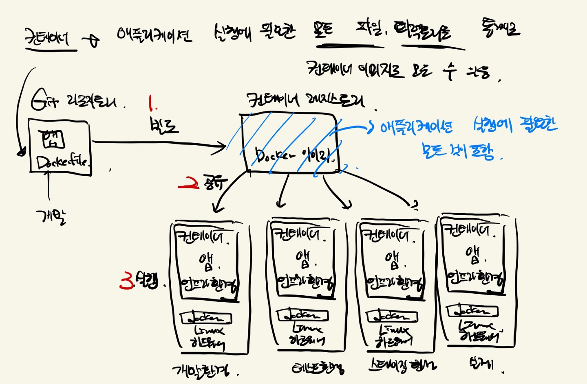

### 쿠버네티스(Kubernetes)는 오픈소스로 되어 있는 컨테이너 오케스트레이션 툴이다.

여기서 이제 모르는 단어를 하나씩 알아보자.

**컨테이너**

애플리케이션이 구동되는 환경(네트워크든, os든, 라이브러리든..) 모두 감싸서 실행할 수 있도록 하는 격리 기술

**컨테이너 런타임**

컨테이너를 다루는 도구

**도커**

컨테이너 런타임 중에서 제일 유명한 것

**쿠버네티스**

도커를 통해 컨테이너를 오케스트레이션 하는 도구

**오케스트레이션**

여러 서버에 걸쳐서 있는 컨테이너 및 사용하는 환경 설정을 관리하는 행위

저렇게 이해하고, 하나씩 자세히 살펴보면서 쿠버네티스가 어떤 일을 하는지 알아보았다.

**컨테이너** : 호스트 OS 상에 논리적인 구획을 만들고 애플리케이션을 실행시키는 데 필요한 라이브러리나 애플리케이션 등을 하나로 모아서 마치 전용 서버인 것처럼 만든 것.

호스트 OS가 우리의 window라고 생각하면, 해당 os의 리소스들을 이제 논리적으로(물리적X) 분리하여 여러 컨테이너가 공유하여 사용하게 된다. 컨테이너는 서버 가상화보다 오버헤드가 적어서 가볍고 속도가 빠르다. (저번에 도커에서 배움!)

보통 우리가 애플리케이션을 개발하면, 로컬에서 앱을 만들고, OS, 네트워크 환경을 설정하고, 라이브러리나 미들웨어를 설치하여서 만든다. 근데 문제는 로컬에서는 잘 되던 프로그램이 실제 환경에 배포하면 정상적으로 움직이지 않는다. 이건 환경이랑 설정이 달라서 생기는 문제이다.

컨테이너를 사용하면 애플리케이션 실행에 필요한 모든 파일과 디렉토리를 통째로 컨테이너 이미지로 모을 수 있다.

그럼 우리가 앱을 개발해서 github에 앱이랑 Dockerfile을 같이 해서 컨테이너 이미지를 작성한다. 이 이미지는 OS 커널과 호환성이 있어서 컨테이너가 작동하는 환경이라면 이미지를 받아서 어디서든지 작동시킬 수 있다. 그럼 컨테이너를 작동시키는 곳에서는 어디서든 가능하게 되는 것이다.

컨테이너 이미지를 관리해주는 것은 레지스트리이다. 컨테이너 이미지는 레지스트리로 공유할 수 있다. 도커의 공식 레지스트리는 Docker Hub이다. 그럼 이제 우리가 Ubuntu같은 OS를 사용하고 싶으면 Ubuntu 베이스 이미지를 받아서 사용하면 된다.

도커 이미지로 그래서 여러 개의 컨테이너를 시작시키는 것이다. 도커 명령을 사용해서 컨테이너의 시작, 정지, 파기를 하면 된다.

도커의 경우는 하나의 OS를 여러 컨테이너에서 공유한다.  컨테이너 안에서 작동하는 프로세스를 하나의 그룹으로 생각하고, 그룹별로 각각 파일 시스템이나 호스트명, 네트워크 들을 할당한다. 여기서 이제 그룹이 다르면 프로세스나 파일에 대한 접근 자체가 불가능하다.

이렇게 되면, 컨테이너를 독립된 공간으로 관리할 수 있다. 이렇게 그룹으로 나눌려면 리눅스 커널 기능인 namespace랑 cgroups, 그리고 Windows 컨테이너 기술을 사용해야 한다.

여기까지는 도커의 사용과 비슷하다. 그런데 이렇게 많은 컨테이너를 사용하려면 시스템의 트래픽 증감이나 가용성 요건을 고려한 후에 여러 호스트 머신으로 구성되는 분산 환경을 구축해야 한다.

그래서 컨테이너 오케스트레이션 툴이 필요하다. 여기서 젤 유명한게 쿠버네티스이고, 도커 Swarm, Apache Mesos/Marathon이라는 예시들도 있다.

### 쿠버네티스의 역할

- 여러 서버에서 컨테이너를 분산해서 배치해주고 관리
- 문제가 생긴 컨테이너를 교체해줌
- 컨테이너가 사용할 비밀번호나 환경 설정을 관리하고 주입해줌
- 장애 발생 시 자동 복구

쿠버네티스는 정상 상태를 저장한다. 즉, 정상 상태가 아니면 문제가 생겼다고 판단해서 정상 상태로 되돌린다. ‘시스템이 원래 되어 있어야 할 모습’을 선언적 설정으로 설정해준다.

### 결론적으로 앞으로 내가 해야 할 것들

결론적으로는 졸업프로젝트를 위해 쿠버네티스를 공부 중인 것인데.. 클라우드 환경이 아닌 온프레미스로 해야 졸업 프로젝트의 목표가 달성되는 것이다. 하지만 먼저 Azure 환경에서 쿠버네티스에 대한 실습들을 한번 시도해보고, 온프레미스 환경에서 클러스터링을 해서 해결하는 것을 점차적으로 해보겠다.

앞으로도 쿠버네티스에 관련된 정보를 계속해서 기록하겠다.