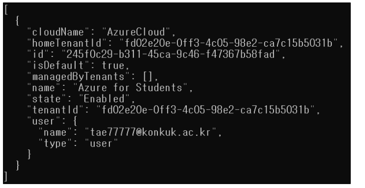
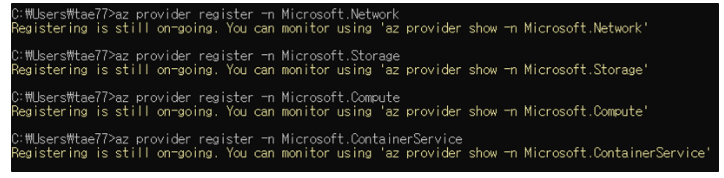
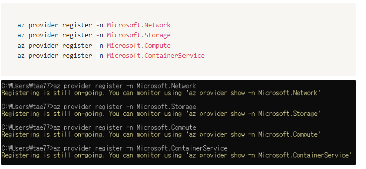
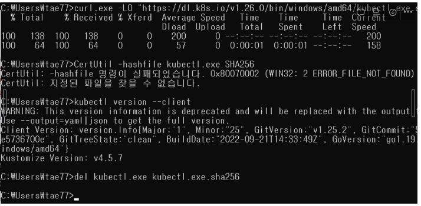
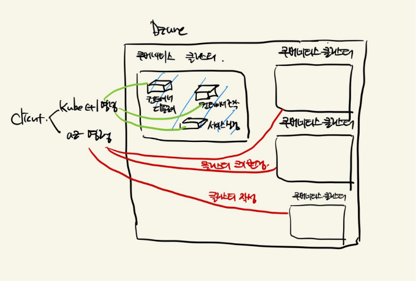

# 쿠버네티스 환경 구축 3단계 (1)

**쿠버네티스**

쿠버네티스는 컨테이너 애플리케이션을 분산 환경에서 운용 관리하기 위한 오케스트레이션 툴이다. (단어 하나씩 뜯어봤는데도,, 말이 어려워서 기억하기 위해..)

결과적으로는 온프레미스 환경에서 쿠버네티스를 사용할 것이지만, 일단 Azure를 사용해서 클라우드 환경에서 쿠버네티스를 사용해 보겠다!

## 컨테이너 이미지 빌드와 공개

### 전체적인 흐름

컨테이너 애플리케이션을 개발하고 운용할 때의 흐름을 알고, 순서대로 진행해 보겠다. 

1. **개발 환경 준비**  Azure를 실행하기 위해서 IDE나 로그인 등을 해야함
2. **컨테이너 이미지의 작성 및 공유**  컨테이너를 동작시키려면 애플리케이션을 움직이기 위한 것들이 이미지로 있어야 한다. 필요한 것들로는 바이너리, OS, 네트워크 같은 설정들을 이야기 한다.  만약 도커일 경우에는 Dockerfile이라는 텍스트 파일에 구성을 기술하고, 이것을 빌드하면 빌드된 것을 실행 환경에서 이용 가능한 레포지토리로 공유한다. (마치 로컬에서, github에 커밋을 하고 다른 컴퓨터에서 pull해서 사용하는 느낌이였다.) 
3. **클러스터 작성 (실제 환경 작성)**  실제로 컨테이너 애플리케이션을 작동시키는 서버를 구축해야 한다. 개발 환경이나 테스트 환경에서는 로컬 머신으로 작동시키지만, 서비스 공개할려면 클라우드 서비스를 사용하든지, 실제 서버 컴퓨터(온프레미스) 환경이 있어야 한다. 

### [ 1번의 진행과정 ]

### 쿠버네티스 클러스터
쿠버네티스 클러스터란, 쿠버네티스가 분산 환경에서 여러 대의 서버나 스토리지와 같은 컴퓨팅 리소스가 네트워크로 연결된 환경에서 각각 다른 역할을 가지면서 서로 협조해 가며 컨테이너 애플리케이션을 실행시키는 것을 의미한다.
  쿠버네티스 클러스터를 만들려면 여러 대의 서버나 가상 머신에 쿠버네티스를 설치하고 네트워크 설정 등을 해야 한다. 

**클러스터를 쉽게 운용하기 위해서 먼저 Azure 컨테이너 서비스를 이용해보겠다!**

1. 먼저 Azure에 개인 계정을 만들어야 된다. (나는 건국대학교 학생 계정을 이용해서 1년 무료로 사용할 수 있다고 해서 학교 계정을 사용하였다)
2. Azure 포털 사이트에서도 cli 창을 띄울 수 있었는데, 리눅스 명령어도 익힐 겸 Azure CLI 명령을 설치해서 할 수 있었다. (사이트에서 MSI 인스톨러로 다운받았다.)
3. 만약 Azure에 로그인을 하면 cmd창을 켜서 **az login**을 입력하면, redirect페이지가 나오고 로그인이 된다. 

4. Azure의 서비스를 이용하기 위해 리소스 프로바이더도 할당한다.

 

**Azure 리소스 프로바이더를 활성화해야 하는 이유**   Azure에서 리소스 프로바이더를 활성화해야 하는 이유는 해당 리소스를 생성하고 관리, 조작하기 위해서이다. Azure의 각각의 서비스는 Azure Resource Manager(ARM)이라는 것에 의해서 관리되는데, 리소스 프로바이더는 이 ARM에서 각각의 서비스에 대한 API 엔드포인트를 제공한다. 

그래서 Azure 리소스를 만들거나 관리하려면 해당 리소스 유형에 대한 프로바이더가 활성화되어 있어야 한다.

예를 들어서 Azure Virtual Machines를 만들려면 Microsoft.Compute 리소스 프로바이더가 필요하다. 이 프로바이더는 Virtual Machine과 관련된 API 엔드포인트를 제공해서, 가상 머신의 생성, 삭제, 업데이트 등의 작업을 수행할 수 있도록 한다.

여기서는 Microsoft.Network, Storage, Compute, ContainerService 모두 활성화시켰다.

### kubectl 명령
쿠버네티스 클러스터를 조작하려면 GUI를 사용해도 되는데, 일반적으로는 명령으로 조작한다고 한다.

명령으로 조작하기 위해서는 kubectl을 사용한다. kubectl 명령은 쿠버네티스 클러스터의 상태를 확인하거나 구성을 변경하기 위한 것이다. 개발을 하는 클라이언트 머신에 설치하면 된다.

나는 Window이기 때문에 쿠버네티스 페이지에 있는대로 따라하였다.

[Install and Set Up kubectl on Windows](https://kubernetes.io/docs/tasks/tools/install-kubectl-windows/)

(몇번 잘못 입력한 다음에... 성공)

### 그럼 kubectl과 az 명령은 각각 언제 필요?
지금 명령만 2개를 설치했는데, 두 명령은 차이가 있다. kubectl 명령은 쿠버네티스 클러스터 안에서 움직이는 컨테이너 애플리케이션을 조작하는 것이고, az 명령은 Azure를 사용해서 쿠버네티스 클러스터 자체의 구축이나 삭제 등을 하는 것이다.

설치가 복잡해서.. 2단계는 내일 써보겠다!

